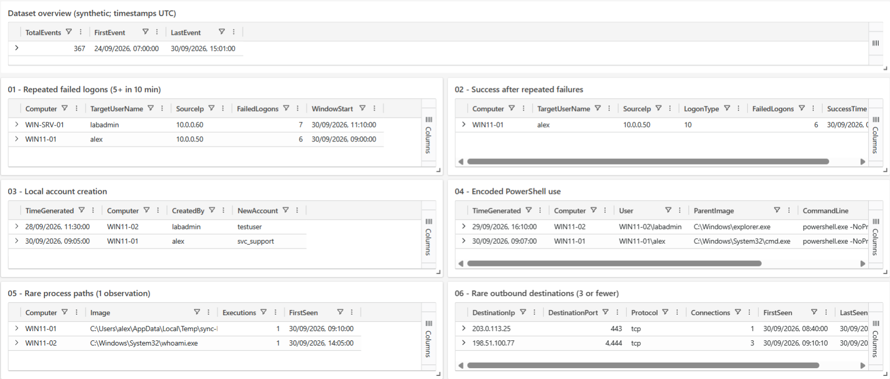

# KQL Threat Hunting and Detection Engineering Lab

**Author:** Nikil Jacob | **Platform:** Azure Data Explorer free cluster | **Completed:** October 2026

A defensive portfolio lab using **367 synthetic Windows Security and Sysmon-style events**. I ran and validated six hunting workflows, investigated their context, and built a seven-tile dashboard. The central investigation follows a failed-then-successful logon sequence, local account creation, process activity and three network connections on `WIN11-01`.

The outcome is reproducible KQL, six evidence-based case write-ups and a native ADX dashboard template. The records are fictional; the findings demonstrate investigation methods and careful interpretation of limited evidence.

*Actual dashboard results, validated on 5 October 2026. The publication excerpt omits the global account header. All event timestamps are UTC.*

## Start here

- [Illustrated project case study (PDF)](docs/project02-case-study.pdf)
- [Setup and reproduction](docs/setup-and-reproduction.md)
- [Validation results and detection limits](docs/validation-and-limitations.md)
- [Dataset, schema and provenance](data/README.md)
- [Dashboard import guide](dashboards/README.md)

## Validated findings

| Hunt | Result in this dataset | Query | Investigation |
|---|---|---|---|
| 01. Repeated failed logons | Two groups: 6 failures for `alex`; 7 for `labadmin` | [KQL](queries/01-multiple-failed-logons.kql) | [Case 01](investigations/01-multiple-failed-logons.md) |
| 02. Success after repeated failures | One qualifying success: `alex`, after 6 failures | [KQL](queries/02-success-after-failed-logons.kql) | [Case 02](investigations/02-success-after-failed-logons.md) |
| 03. Local account creation | Two local accounts: `testuser` and `svc_support` | [KQL](queries/03-local-account-creation.kql) | [Case 03](investigations/03-local-account-creation.md) |
| 04. Encoded PowerShell | Two matches; both decoded to harmless text-output commands | [KQL](queries/04-encoded-powershell.kql) | [Case 04](investigations/04-encoded-powershell.md) |
| 05. Rare process paths | Two host/path pairs with one observation each | [KQL](queries/05-rare-processes.kql) | [Case 05](investigations/05-rare-processes.md) |
| 06. Rare outbound destinations | Two destination groups; 3 helper connections correlated to one process instance | [KQL](queries/06-rare-network-destinations.kql) | [Case 06](investigations/06-rare-network-destinations.md) |

The result counts use different units: groups, events, host/path pairs and connections. They are investigation leads, not a count of confirmed attacks.

## Central investigation

On **30 September 2026**, the following records appear on `WIN11-01` under the `alex` account. These are observations in the synthetic dataset.

| Time (UTC) | Observation |
|---|---|
| 09:00:00-09:02:30 | Six incorrect-password failures from `10.0.0.50`, logon type `10` |
| 09:03:00 | A successful logon with the same host, domain, account, source IP and logon type |
| 09:05:00 | `alex` creates the local `svc_support` account |
| 09:07:00 | Encoded PowerShell with `cmd.exe` as its parent; decoded text is `Write-Output 'KQL-Lab-Demo'` |
| 09:10:00 | `sync-helper.exe` starts from the user's Temp directory; its parent image is PowerShell |
| 09:10:10, 09:11:10, 09:12:10 | Three outbound TCP records to `198.51.100.77:4444` |

The network records match the helper's **Computer + ProcessGuid**, giving a direct process-to-network association within the recorded data. The earlier logon, account creation and PowerShell events supply temporal context. Missing session identifiers and `ParentProcessGuid` prevent proving the full causal chain. The available records do not confirm compromise, malware or command-and-control.

Comparison records help avoid overclaiming: a three-failure logon sequence stays below the threshold, `whoami.exe /all` is also rare, and a browser connection also matches the low-frequency destination hunt.

## Skills demonstrated

- KQL filtering, projection, aggregation, fixed time bins, regular expressions and explicit inner joins.
- Correlating authentication outcomes with matching identity and source fields.
- Reviewing account creation and distinguishing local from domain scope in this lab schema.
- Decoding Base64/UTF-16LE PowerShell text for inspection.
- Assessing rarity with execution context and comparison examples.
- Linking process creation and network events using stable process identifiers.
- Documenting hypotheses, follow-up questions, detection limitations and suitable ATT&CK mappings.
- Exporting and importing a native ADX dashboard.

## Reproduce the lab

1. Create an ADX free cluster and a database named `ThreatHuntingLab`.
2. Import [kql-lab-events.csv](data/kql-lab-events.csv) once into `SecurityLabEvents`, using the first row as headers and the [reference schema](data/README.md).
3. Run the [dataset checks](queries/00-dataset-validation.kql). Expect **367 events**, spanning **2026-09-24 07:00:00 to 2026-09-30 15:01:00 UTC**.
4. Run one complete query block at a time from the six numbered hunt files. Include each block's `let` statements and final expression together.
5. Compare your outputs with [the validation table](docs/validation-and-limitations.md).
6. Configure the cluster URI in the [dashboard template](dashboards/project02-threat-hunting-dashboard-template.json), import it and save the dashboard.

The queries scan a fixed historical snapshot. They intentionally avoid `ago()`, so the findings remain reproducible as calendar time advances. Detailed ingestion and troubleshooting steps are in the [reproduction guide](docs/setup-and-reproduction.md).

## Scope and interpretation

This project uses a normalized, fictional dataset in ADX. It demonstrates manually executed hunts and detection-engineering practice. Live endpoint collection, scheduled Sentinel analytics, incident creation and automated response were outside the completed scope.

The two encoded payloads are harmless demonstration commands. External-looking IPs are reserved documentation addresses. Thresholds and rarity are lab heuristics; the exercise does not estimate production precision, recall or false-positive rates.

ATT&CK references describe investigation hypotheses: password guessing (`T1110.001`), local account creation (`T1136.001`) and potential PowerShell misuse (`T1059.001`). No technique is assigned solely from rarity or a destination port. See [validation and limits](docs/validation-and-limitations.md) for the reasoning.

## Repository contents

| Location | Contents |
|---|---|
| `data/` | The 367-event CSV, provenance notes and reference table definition |
| `queries/` | Dataset checks, six hunt files and the PowerShell text decoder |
| `investigations/` | Six case write-ups with findings, evidence, limits and references |
| `screenshots/` | Publication evidence excerpts and a provenance index |
| `dashboards/` | Portable native JSON template and import instructions |
| `docs/` | Reproduction guide, validation matrix, references and illustrated PDF |
| `scripts/` | Optional standard-library dataset verifier |

Primary documentation is collected in [References](docs/references.md). Further experiments, such as deployed alerts, richer telemetry and production tuning, would be future work rather than completed outcomes.
